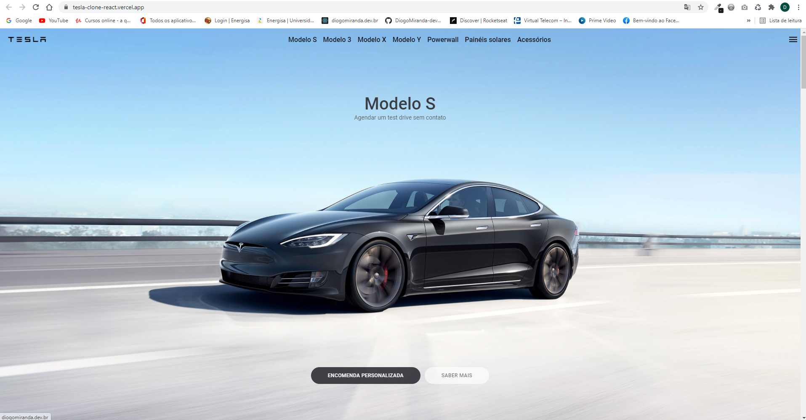
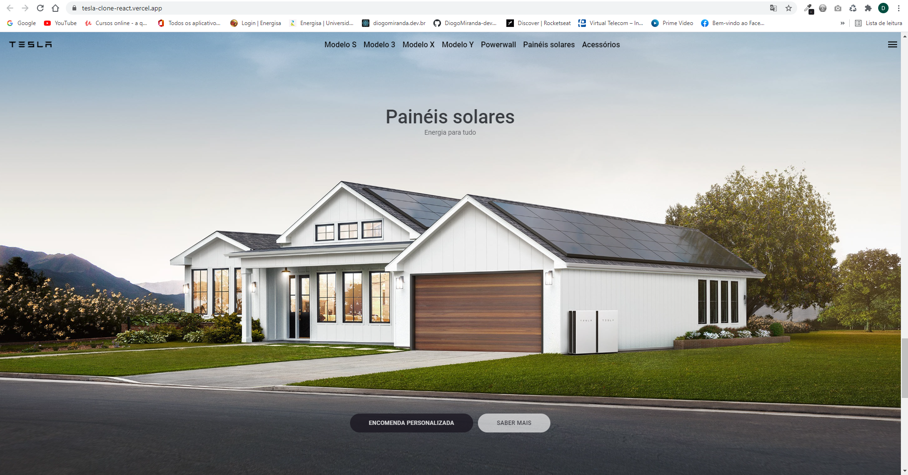
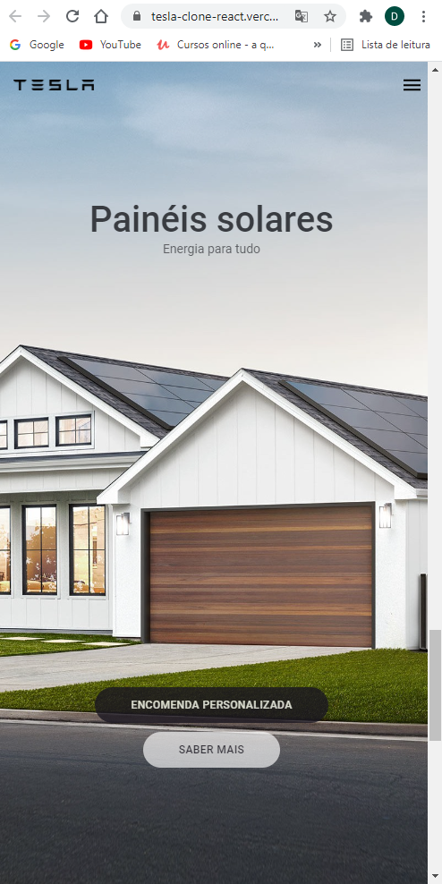
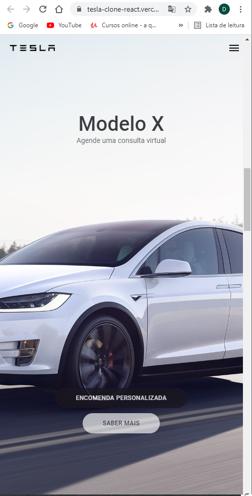

<!-- <h1 align="center">
🚧 Podcastr - NLW#05 | Em Construção 🚧
</h1> -->

<h1 align="center">
   Bem Vindo ao App Tesla - UI Clone
</h1>

<p align="center">
  <a href="#page_facing_up-sobre-o-projeto">Sobre o Projeto</a>&nbsp;&nbsp;&nbsp;|&nbsp;&nbsp;&nbsp;
  <a href="#computer-demo">Demo</a>&nbsp;&nbsp;&nbsp;|&nbsp;&nbsp;&nbsp;
  <a href="#art-layout">Layout</a>&nbsp;&nbsp;&nbsp;|&nbsp;&nbsp;&nbsp;
  <a href="#hammer-Tecnologias">Tecnologias</a>&nbsp;&nbsp;&nbsp;|&nbsp;&nbsp;&nbsp;
  <a href="#blue_book-instalação">Instalação</a>&nbsp;&nbsp;&nbsp;|&nbsp;&nbsp;&nbsp;
  <a href="#astronaut-Autor">Autor</a>&nbsp;&nbsp;&nbsp;|&nbsp;&nbsp;&nbsp;
  <a href="#memo-Licença">Licença</a>
</p>

<!-- ## :information_source: O que é Next Level Week?

O [NLW](https://nextlevelweek.com/inscricao/1) é uma semana prática com muito código, desafios, network e com um único objetivo: levá-lo ao próximo nível.
Através do método da [Rocketseat](https://nextlevelweek.com/inscricao/1), você aprenderá novas ferramentas, tecnologias e descobrirá hacks que irão impulsionar sua carreira.
Um evento online e totalmente gratuito que o ajudará a dar o próximo passo na sua evolução como desenvolvedor.
 -->

## :page_facing_up:🚀 Sobre o Projeto

Neste projeto busquei praticar um pouco mais sobre o React.js e Api.\
Utilizando alguns conceitos básicos do React.js, componentes e organização de pastas dentro de um projeto Web Moderno.\
Além de praticar os conceitos de comunicações com uma API.\

## :computer: Demo
[https://tesla-clone-react-dwkfbqjoh-diogomiranda-dev.vercel.app](https://tesla-clone-react-dwkfbqjoh-diogomiranda-dev.vercel.app)

<!--
# 🚀  API

dados de [https://unsplash.com/](unsplash.com)
-->
# 🌀 clone APP

Interface [https://www.tesla.com/](https://www.tesla.com/)

## :art: Layout
Feito em Live [https://www.youtube.com/watch?v=Mf4Se4ZGcG8&t=1565s](https://www.youtube.com/watch?v=Mf4Se4ZGcG8&t=1565s) para estudo de react,\
Todos os direitos das imagens são da Tesla.

### Web
<h4 align="center">
  
  
</h4>

### Mobile
<h4 align="center">
  
  
</h4>

<!-- #### Theme Dark -->

<!-- <h4 align="center">
  
  
  
  
  
</h4> -->

<!-- #### Theme Light -->

<!-- <h4 align="center">
  
  
  
  
  
</h4> -->
<!-- ### Mobile -->
<!-- 
<h4 align="center">
  
  
  
  <!--  -->
<!-- </h4> -->

<br/>

<!-- ## :tada: Melhorias na Aplicação

    -Adicionado api serverless na aplicação;
    -Adicionado autenticação com github via Auth0;
    -Adicionado Firebase para efetuar autenticação;
    -Adicionado mongodb para salvar informações;
    -Adicionado pagina de Leaderboard na aplicação;
    -Adicionado theme dark na aplicação;
    -Adicionado save theme no localStorage;
    -Adicionado Switch para alterar os themes;
    -Adicionado Toast como notificação;
    -Adicionado Test com Jest;
    -Adicionado storybook para os component;
    -Adicionado opção de PWA na aplicação;
    -Adicionado Ícones para representar os botões;
    -Adicionado uma SideBar
    -Adicionado component para SEO;
    -Efetuado diversos ajustes no designer da aplicação;
    -Efetuado ajustes para o mobile e PWA;

## 🎖 Milestone

    -Melhorar a SSR da aplicação
    -Ajustar autenticação no Mobile
    -Ajustar designer do app para Mobile
    -Adicionar compartilhar com Redes Sociais
    -Concluir os testes
    -Ajustes no Storybook -->

## :hammer: Tecnologias:

- `dependencies`:
- **[React](https://pt-br.reactjs.org/docs/create-a-new-react-app.html)**
- **[React Testing Library](https://testing-library.com/docs/react-testing-library/intro)**
- **[Eslint](https://eslint.org/)**
- **[Prettier](https://prettier.io/)**
- **[Axios](https://github.com/axios/axios)**
- **[Styled Components](https://styled-components.com/)**
- **[framer-motion](https://www.framer.com/motion/)**

- `devDependencies`:
- **[TypeScript](https://www.typescriptlang.org/)**

<!-- 
- **[babel](https://babeljs.io/)**
- **[webpack](https://webpack.js.org/)**
- **[node-sass](https://github.com/sass/node-sass)**
- **[react-feather](https://github.com/feathericons/react-feather)**
- **[immer](https://immerjs.github.io/immer/)**
- **[react-redux](https://react-redux.js.org/)**
- **[react-saga](https://github.com/redux-saga/redux-saga)**
- **[react-modal](https://github.com/reactjs/react-modal)**
- **[Polished](https://polished.js.org/)**
- **[react-toastify](https://github.com/fkhadra/react-toastify)**
- **[miragejs](https://miragejs.com/)**
- **[Firebase](https://firebase.google.com/?hl=pt-br)**
- **[Jest](https://jestjs.io/)**
- **[Storybook](https://storybook.js.org/)**
- **[Eslint](https://eslint.org/)**
- **[Prettier](https://prettier.io/)**
- **[Husky](https://github.com/typicode/husky)**
- **[PlopJS](https://plopjs.com/)**
- **[Styled-Icons](https://styled-icons.js.org/)**
 -->

## :blue_book: Instalação
## 🔎 Comandos

- `dev`: Executa a aplicação em `localhost:3000`
- `build`: Cria a Build do projeto
- `start`: Executa a aplicação em produção
<!-- - `test`: Executa **Jest** para testar todos os componentes e páginas -->
<!-- - `eject`: Executa **Jest** em watch mode -->
<!-- - `server`: Executa o servidor fake `localhost:3333` -->

## 🚀 Como rodar este projeto

Para clonar e executar este aplicativo, você precisará de [Git](https://git-scm.com) e [NodeJs](https://nodejs.org/en/) Instalado em seu computador.

### 🌀 Clonando o repositório

```bash
# Clone este repositório
$ git clone https://github.com/DiogoMiranda-dev/tesla_clone_react.git

# Acesse a pasta do projeto no terminal/cmd
$ cd tesla_clone_react
```

### 🎲 Rodando a Aplicação

```bash
# Instale as dependências
$ yarn install

# Execute a Aplicação em Desenvolvimento
$ yarn dev
# O servidor inciará na porta:3000 - acesse http://localhost:3000

```
<!-- # Execute o server fake
$ yarn server
# O servidor inciará na porta:3333 - acesse http://localhost:3333 -->

<!-- ### 💾 Comandos Úteis

```bash
#Rodar os testes
$ yarn test
``` -->


<!--
### 📁 Configuração .ENV

 ```bash
#adicionado .env.example no projeto, lembrar de adicionar as variáveis de ambiente conforme o exemplo

# FIREBASE
NEXT_PUBLIC_APIKEY=
NEXT_PUBLIC_AUTHDOMAIN=
NEXT_PUBLIC_PROJECTID=
NEXT_PUBLIC_STORAGEBUCKET=
NEXT_PUBLIC_MESSAGINGSENDERID=
NEXT_PUBLIC_APPID=
NEXT_PUBLIC_MEASUREMENTID=

# MONGODB
MONGODB_URI=

# API URLS
BASE_URL=

```
 -->
## :astronaut: Autor

<a href="https://github.com/DiogoMiranda-dev/">
 
 <br />
  
</a>
<a href="https://www.linkedin.com/in/diogo-miranda-2233657a/">
  
</a>
<a href="https://www.instagram.com/diogomiranda.dev/">
  
</a>

Feito com ❤️ por Diogo Miranda  🥇 :astronaut:  [https://diogomiranda.dev.br/](https://diogomiranda.dev.br/)


## :memo: Licença

Este projeto esta sobe a licença MIT. Veja a [LICENÇA](https://opensource.org/licenses/MIT) para saber mais.
